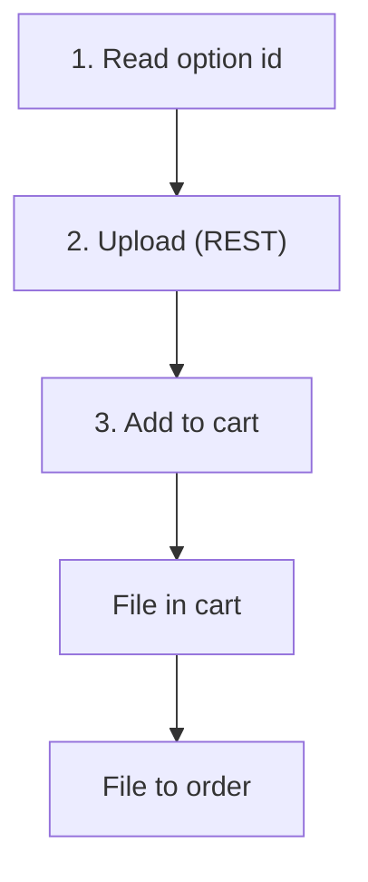

# Upload Customizable File

A `file`-type customizable option (e.g. "upload your design") needs a binary file. **A file cannot travel over GraphQL**, so the upload itself is a REST call — but the rest of the flow stays in GraphQL. You upload once over REST to get a **token**, then reference the token in the GraphQL [Add to Cart](/api/graphql-api/shop/mutations/add-to-cart) mutation.

## The flow

1. **Read the option** from the product's `customizableOptions` ([Single Product](/api/graphql-api/shop/queries/get-product)) — a `file`-type option carries its `_id` and the allowed extensions.
2. **Upload the file over REST** — `POST /api/shop/customizable-option-files` (multipart) with `product_id`, `option_id`, `file`. It returns a short-lived `token`. This is REST-only; see the [REST upload endpoint](/api/rest-api/shop/cart/upload-customizable-file) for the full request/response.
3. **Add to cart over GraphQL** — pass the token as that option's value: `customizableOptions: { "11": ["<token>"] }`. The mutation carries only the token string.
4. **Core owns the rest** — the file is stored with the cart, then moved to the order automatically at place-order.

## Which file formats are allowed?

There is no fixed API list — the **admin sets the allowed extensions per option** (the option's "Supported File Extensions", e.g. `pdf` or `jpg,png,pdf`). Read them from the product's `customizableOptions`; a mismatched extension is rejected at upload.

## Related

- [Add to Cart](/api/graphql-api/shop/mutations/add-to-cart) — reference the token here
- [Single Product](/api/graphql-api/shop/queries/get-product) — read the customizable options
- [REST upload endpoint](/api/rest-api/shop/cart/upload-customizable-file) — the actual multipart upload
