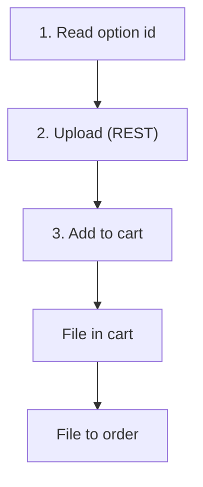

# Upload Customizable-Option File

Stage a file for a **file-type** customizable option. A file cannot travel in a JSON body, so uploading is a separate REST call that returns a short-lived **token**; [Add to Cart](/api/rest-api/shop/cart/add-to-cart) then references the token. This keeps Add to Cart pure JSON, so it works on both REST and GraphQL.

## The flow



1. **Read the option** from the product's `customizableOptions` ([Get Product](/api/rest-api/shop/products/get-product)) — a `file`-type option carries its `id` and the allowed extensions.
2. **Upload the file here** (this endpoint) → you get a short-lived `token`. This is the only REST-required step; GraphQL cannot carry a binary.
3. **Add to cart** with the token as that option's value — over [REST](/api/rest-api/shop/cart/add-to-cart) or GraphQL. The mutation carries only the token string.
4. **Core owns the rest** — the file is stored with the cart, then moved to the order automatically when the order is placed.

## Endpoint

```
POST /api/shop/customizable-option-files
```

## Request (multipart/form-data)

| Field | Type | Required | Description |
|-------|------|----------|-------------|
| `product_id` | integer | Yes | The product that owns the option |
| `option_id` | integer | Yes | The `file`-type customizable option id (from the product's `customizableOptions`) |
| `file` | file | Yes | The file — its extension must be in the option's supported extensions and within the size limit |

Send the storefront key and the same cart/customer Bearer token you will use for Add to Cart.

## Response (201)

| Field | Type | Description |
|-------|------|-------------|
| `token` | string | Short-lived reference to the staged file |
| `fileName` | string | The original file name |
| `optionId` | integer | The option the file is for |

## Then add to cart

Send the token as the option's value on [Add to Cart](/api/rest-api/shop/cart/add-to-cart):

```json
"customizableOptions": { "11": ["<token>"] }
```

## Notes

- The token expires after a short window (default 60 minutes). If it expires, upload again.
- The file is stored with the cart on Add to Cart and is moved to the order automatically when the order is placed — you do not save it separately.
- The upload is **REST-only** (binary); Add to Cart with the token works on REST and GraphQL.

## Related Resources

- [Add to Cart](/api/rest-api/shop/cart/add-to-cart)
- [Get Product](/api/rest-api/shop/products/get-product)
