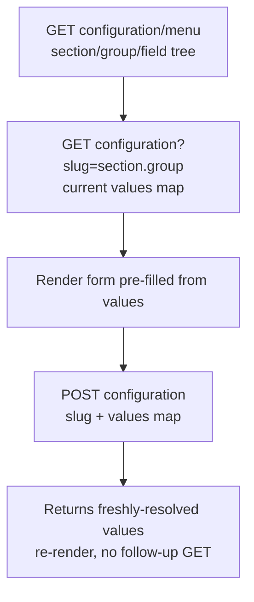

# Configuration (Admin)

The store's flat key/value settings — everything under **Configuration** in the admin (general, catalog, sales, customer, email, payment, shipping, …). Unlike the rest of the admin API, Configuration is **not one endpoint per screen**: its schema is registered at runtime by every installed package, so the API exposes **three generic endpoints** that work across any current or future section. Everything is keyed by a **slug** — a dotted section path like `sales.order_settings` or `general.content`.

## Agent-ask inputs

- **Integration token** — ask the user; send as `Authorization: Bearer <id>|<token>`. Needs the configuration permission (else `403`).
- **Server URL** — ask the user for their Bagisto server's base URL (e.g. `https://store.example.com`) and prefix every endpoint path with it. Never assume localhost or a demo domain.

## The three endpoints

| Operation | REST | GraphQL field |
|-----------|------|---------------|
| Menu (schema) | [GET configuration/menu](/api/rest-api/admin/configuration/menu) | `menuAdminConfigurationMenu` |
| Slugs (discovery) | [GET configuration/slugs](/api/rest-api/admin/configuration/slugs) | `listAdminConfigurationSlug` |
| Values | [GET configuration?slug=…](/api/rest-api/admin/configuration/values) | `valuesAdminConfigurationValues` |
| Update | [POST configuration](/api/rest-api/admin/configuration/update) | `createAdminConfigurationUpdate` |

## Flow: schema → values → update

- **Menu** returns the whole tree (sections → groups → fields), each field with its `code`, `type`, `title`, default, validation, and whether it's channel-/locale-based — build the config nav AND know which input control each field needs. `?slug=<section>` scopes to one node; `?include_values=true` (+ `?channel=`/`?locale=`) embeds values so one call renders a populated form.
- **Slugs** lists every registered slug so you can discover what to pass to Values/Update without trial-and-error.
- **Values** returns a flat `{ dottedCode: stringValue }` map for a slug (falling back to each field's default). **The slug is required** — the endpoint refuses to dump the whole table.
- **Update** writes a `values` map for a slug and returns the freshly-resolved values.

## Field types → controls

`boolean` → toggle · `select`/`multiselect` → dropdown(s) from the field's options · `text`/`textarea`/`password` → inputs · `image`/`file` → upload · `color` → colour picker · `type: "custom"` (`customView`) → **read-only over the API** (route the user to the admin panel).

**Channel- / locale-based fields** vary per storefront context — add channel/locale switchers, and pass the matching `?channel=`/`?locale=` (or `channel`/`locale` keys in the update body) on read and write.

## Two hard rules when writing config

1. **Every key must start with the slug.** On update, every key in `values` must be prefixed with that request's `slug.` (slug `sales.order_settings` → keys like `sales.order_settings.reorder.admin`). The server **refuses any key that escapes the slug** (`400`) — this prevents overwriting an unrelated section. Build keys from the slug you're editing, never a hand-typed path.
2. **File/image fields are REST-only.** Config `image`/`file` fields upload via a **multipart** `POST /api/admin/configuration` with the file in the `values[<dotted.code>]` part. The GraphQL update rejects file-type fields — use REST for any screen with an upload. Scalar-only updates work over either transport.

Validation is **server-side** from each field's own rule (not trusted from the client) — a bad value returns `422` with the offending field; show it inline.

## Status codes to handle

`200` read/update OK · `400` missing `slug` or a key escaping the slug · `401` unauthenticated · `403` permission · `422` field validation failed (or a file field sent over GraphQL — use REST).
