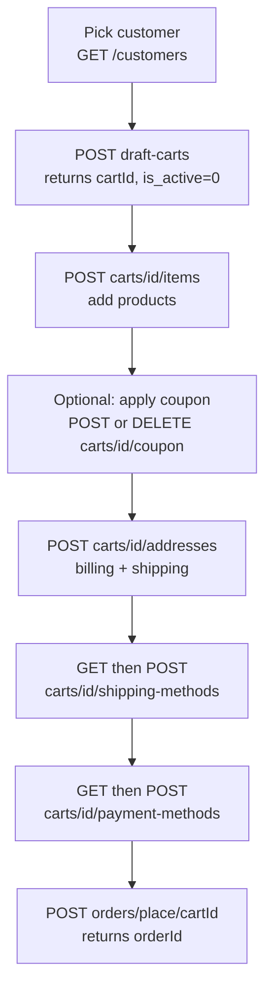

# Admin Create-Order Flow

Place an order for a customer from the admin side — the API equivalent of the admin panel's **Create Order** screen. Every request carries the admin Integration token:

```
Authorization: Bearer <id>|<token>
```

The flow builds a **draft cart**, fills it, then places it. It is a **strict sequential state machine** keyed by a draft cart the admin owns (`is_active = 0`) — do the steps in order, or a step returns `409` naming what's missing.

## Agent-ask inputs

- **Integration token** — ask the user; send as `Authorization: Bearer <id>|<token>`. Placing an order needs the order-create permission (else `403`).
- **Server URL** — ask the user for their Bagisto server's base URL (e.g. `https://store.example.com`) and prefix every endpoint path with it. Never assume localhost or a demo domain.

## Flow



Coupon is optional — apply it after items are in the cart, or skip straight to addresses.

## The 6 steps (REST)

| # | Step | Call |
|---|------|------|
| 1 | Create a draft cart for the customer | `POST /api/admin/customers/{customerId}/draft-carts` → returns `cartId` |
| 2 | Add items | `POST /api/admin/carts/{cartId}/items` |
| 3 | Save billing + shipping addresses | `POST /api/admin/carts/{cartId}/addresses` |
| 4 | List then set a shipping method | `GET` then `POST /api/admin/carts/{cartId}/shipping-methods` |
| 5 | List then set a payment method | `GET` then `POST /api/admin/carts/{cartId}/payment-methods` |
| 6 | Place the order | `POST /api/admin/orders/place/{cartId}` → returns `orderId` |

Open the Sales → Orders pages for the exact request bodies. Read the draft cart any time with `GET /api/admin/carts/{cartId}` (items, totals, addresses, selected methods).

## Theory & gotchas

- **Sequence is enforced (409).** Calling a step before its prerequisite returns `409` with a message naming what's missing (shipping needs addresses; payment needs shipping; place needs the whole chain). Gate the UI on each prerequisite to avoid round-trips.
- **Draft-only (403).** These cart endpoints operate only on `is_active = 0` draft carts. Point them at a storefront (active) cart and they return `403`.
- **Add-item is product-type-specific.** The body forwards to add-product, so every type works (simple/configurable/bundle/grouped/downloadable/virtual) — configurable/grouped/bundle/downloadable need their option selections. Update qty with `PUT /carts/{cartId}/items` (`{ qty: { itemId: newQty } }`); remove with `DELETE /carts/{cartId}/items` (`{ cartItemId }`).
- **Booking is blocked (400).** Core ships no booking partial in Create-Order, so booking products are rejected — matches the admin panel.
- **Non-saleable is rejected up front (400)** and the draft cart is **preserved** so you can add a different product. (Adding a non-saleable item and letting totals collect would delete the empty cart — the guard prevents that.)
- **Place accepts only `cashondelivery` / `moneytransfer` (422).** The admin Create-Order screen hardcodes this same restriction; other payment methods are rejected at place time (you can still *list* all supported methods).
- **Addresses** take camelCase keys (`{ billing: { …, useForShipping }, shipping? }`). Prefill from the customer's book: `GET /api/admin/customers/{customerId}/addresses`.

## Adding items — where they come from (Step 2 in depth)

Adding items is the richest step. The admin doesn't just type SKUs — the Create-Order screen offers **five ways to find products for the chosen customer**, and each feeds the same add-item call (`POST /api/admin/carts/{cartId}/items`).

**1. Search the catalog.** [`GET /api/admin/products`](/api/rest-api/admin/catalog/products/list) is the slim Add-Product search (sku / name / price / image / saleable) — the search box on the screen. This is a *different* endpoint from the Products datagrid; it's the picker. Find the product, then add it.

**2–5. Pull from the customer's context.** Four read-only panels surface products the customer already showed interest in, so the admin can one-click add them:

| Panel | Endpoint |
|-------|----------|
| Customer's active (storefront) cart items | `GET /api/admin/customers/{customerId}/cart-items` |
| Wishlist items | `GET /api/admin/customers/{customerId}/wishlist-items` |
| Recent order items (last ~5 ordered products) | `GET /api/admin/customers/{customerId}/recent-order-items` |
| Compare items | `GET /api/admin/customers/{customerId}/compare-items` |

Each panel returns product rows (id, sku, name, price, image); take the product id and add it via the add-item call. Surface all five as tabs/panels next to the cart so the admin can build the order from search **and** the customer's own cart/wishlist/recent/compare lists.

**Add / update / remove:**

- Add: `POST /api/admin/carts/{cartId}/items` — the body forwards to add-product, so every type works (configurable / grouped / bundle / downloadable need their option selections).
- Update qty: `PUT /api/admin/carts/{cartId}/items` (`{ qty: { itemId: newQty } }`).
- Remove: `DELETE /api/admin/carts/{cartId}/items` (`{ cartItemId }`).

## GraphQL variant — select result fields, never `id`

The draft-cart and cart-write operations are **actions**, not fetchable resources, so they have **no selectable `id`**. Select the result fields instead, or the query returns an internal-server error.

Step 1 — create the draft cart (select `cartId`, not `id`):

```graphql
mutation CreateDraftCart($input: createAdminDraftCartInput!) {
  createAdminDraftCart(input: $input) {
    adminDraftCart {
      cartId
      customerId
      success
      message
    }
  }
}
```

```json
{
  "input": {
    "customerId": 1
  }
}
```

Step 6 — place the order (select `orderId`, not `id`):

```graphql
mutation PlaceOrder($input: createAdminPlaceOrderInput!) {
  createAdminPlaceOrder(input: $input) {
    adminPlaceOrder {
      orderId
      incrementId
      grandTotal
      success
      message
    }
  }
}
```

```json
{
  "input": {
    "cartId": 42
  }
}
```

The intermediate cart mutations (add item, save addresses, set shipping/payment method) likewise return the updated cart payload — select the cart's contents and the `success` / `message` fields, not `id`.

## Why `id` is not selectable here

Fetchable resources — a customer, a product, a placed order — have a `GET /…/{id}` route, so GraphQL can resolve their `id`. Action operations (create-draft-cart, cart writes, place-order) have no such route, so there is no `id` to return. Read the action's result fields (`cartId`, `orderId`, `status`, `success`, `message`) instead.

## Status codes to handle

`200/201` success · `401` unauthenticated · `403` forbidden · `404` cart/customer not found · `409` wrong step order (e.g. shipping before addresses) · `422` validation (e.g. below minimum order amount, unsupported payment method).
