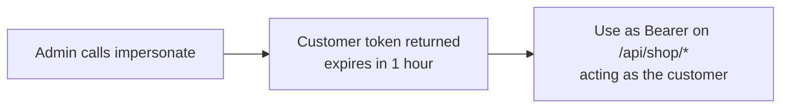

# Customers — Impersonate & GDPR (Admin)

Most of the Customers menu is straight CRUD — customers, groups, review moderation, notes, addresses — covered in the [blueprint](/api/workflows/admin/build-an-admin-dashboard#4-customers). Two flows need explaining because they don't map to a simple call: **impersonation** (the headless version of "login as customer") and **GDPR** (approving a request can cascade a delete, and the data download dumps every related table).

## Agent-ask inputs

- **Integration token** — ask the user; send as `Authorization: Bearer <id>|<token>`. Impersonate and GDPR need their permissions (customer-edit, GDPR-view/edit/delete), else the call returns 403.
- **Server URL** — ask the user for their Bagisto server's base URL (e.g. `https://store.example.com`) and prefix every endpoint path with it. Never assume localhost or a demo domain.

## Impersonate ("Login as Customer")

The admin panel's "Login as Customer" does a session login and redirects to the storefront — which can't translate to a stateless API. Instead, [impersonate](/api/rest-api/admin/customers/impersonate/create) issues a **short-lived customer token** that the client then uses to act as that customer against the Shop API.

`POST /api/admin/customers/{customerId}/impersonate` returns the customer token plus the customer's id, email, and name, the impersonating admin's id, and an expiry. The plaintext token is shown once.

That token behaves exactly like a storefront login token: send it as `Authorization: Bearer <token>` alongside the storefront key on Shop API calls. It expires in one hour and carries an audit marker naming the admin who issued it. So "login as customer" becomes "get a customer token" — the correct headless translation. Requires the customer-edit permission.

## GDPR data requests

The queue has a [list](/api/rest-api/admin/customers/gdpr/list) and a [detail](/api/rest-api/admin/customers/gdpr/detail) view, plus status updates and two actions. A request has a type (update or delete) and a status (pending, processing, declined, approved, or revoked).

### Update status

[Update](/api/rest-api/admin/customers/gdpr/update) (a PUT) is a pure metadata change — it sets the status and an optional message, and fires the status-update email listener. Use it for moves like pending → processing or pending → declined. An invalid status is rejected with 422.

### Process (the destructive action)

[Process](/api/rest-api/admin/customers/gdpr/process) (`POST /gdpr-requests/{id}/process`) is where a request is actually carried out:

- A **delete** request is approved **and cascades a real customer delete** — it runs the core delete so the GDPR module's own listeners fire.
- An **update** request is marked approved but **leaves the customer untouched**. The request only carries a free-form message describing what to change; apply the actual edit through the normal customer-update endpoint afterward.

Processing an already-approved or revoked request is refused with 422. Over GraphQL the input field is `requestId` (the plain `id` is shadowed on mutation inputs). Requires the GDPR-edit permission.

### Download data

[Download data](/api/rest-api/admin/customers/gdpr/download-data) (`POST /customers/{customerId}/gdpr-download-data`) is ad-hoc — it isn't tied to a request. It returns the customer's full footprint (profile, addresses, orders, reviews, wishlist, notes) with the password and remember-token stripped. Requires the GDPR-view permission.

### Delete

[Delete](/api/rest-api/admin/customers/gdpr/delete) removes the request row (a hard delete). Requires the GDPR-delete permission.

## Gotcha: deleting a customer with active orders

The plain customer delete is guarded — a customer with pending or processing orders can't be deleted, and the call returns 400. The GDPR delete-request path runs that same core delete, so the same guard applies. Resolve or cancel the customer's active orders first.

## GraphQL notes

Impersonate, GDPR process, and download-data are action / result mutations — select the documented result fields (the token, the customer id, `requestId`, `success`, and so on), not a generic `id`. See the [result-field rule](/api/workflows/admin/#graphql-the-must-know-rules).

## Status codes to handle

Every call below links to its **REST** endpoint page for concreteness. The sequence is transport-agnostic — the same flow works over GraphQL with the equivalent query or mutation, and each REST page cross-links to its GraphQL twin. Pick whichever transport your client uses; only the request shape changes, never the order of steps.

200 / 201 success · 400 delete guard (active orders) · 401 unauthenticated · 403 permission · 404 not found · 422 invalid status or an already-processed GDPR request.
