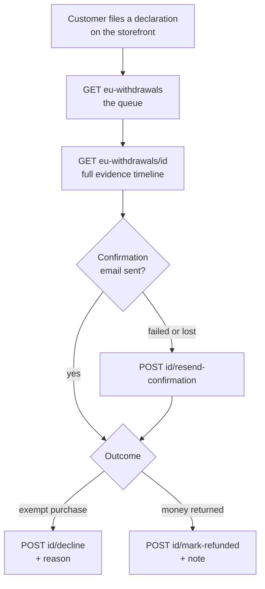

# EU Withdrawal (Admin)

Handle the right-of-withdrawal declarations customers file against their orders: review the queue, resend the acknowledgement, and record the outcome. This is the back-office half of the storefront [EU Withdrawal](/api/workflows/shop/eu-withdrawal) flow, and it is a **compliance record** rather than an ordinary work queue — the sequence below exists to preserve evidence, not just to move a row along.

Every call below links to its **REST** endpoint page for concreteness. The sequence is transport-agnostic — the same flow works over GraphQL with the equivalent query or mutation, and each REST page cross-links to its GraphQL twin. Pick whichever transport your client uses; only the request shape changes, never the order of steps.

## Agent-ask inputs

- **Integration token** — ask the user; send as `Authorization: Bearer <id>|<token>`. Listing and viewing need the EU-withdrawals permission; each action carries its own, so a token that can read the queue may still be refused on decline or mark-refunded with a 403.
- **Server URL** — ask the user for their Bagisto server's base URL (e.g. `https://store.example.com`) and prefix every endpoint path with it. Never assume localhost or a demo domain.

## The flow

| # | Step | Call |
|---|------|------|
| 1 | List declarations | [List EU Withdrawals](/api/rest-api/admin/sales/eu-withdrawal/list-eu-withdrawals) |
| 2 | Open one | [Get EU Withdrawal](/api/rest-api/admin/sales/eu-withdrawal/get-eu-withdrawal) |
| 3 | Re-send the acknowledgement | [Resend Confirmation](/api/rest-api/admin/sales/eu-withdrawal/resend-confirmation) |
| 4a | Refuse it | [Decline](/api/rest-api/admin/sales/eu-withdrawal/decline) |
| 4b | Record the refund | [Mark Refunded](/api/rest-api/admin/sales/eu-withdrawal/mark-refunded) |

## The two outcomes overwrite each other

Decline and mark-refunded are **mutually exclusive**, and each clears the other's metadata. Declining a declaration that was previously marked refunded wipes `refundedAt`, `refundedByUserId`, `refundedByName`, and `refundNote`; marking refunded wipes the decline fields the same way.

A declaration therefore always reflects one current outcome, never a history of both. If you need the earlier decision preserved, capture it before overwriting — the API will not keep it for you. Build the UI so switching outcome is a deliberate act rather than an easy mis-click.

## Marking refunded does not move money

This action is bookkeeping. It records that a refund happened out-of-band — through the payment gateway, a bank transfer, or a store credit — and stamps who recorded it and when. It does not create a refund against the order, so it will not appear in [Sales → Refunds](/api/workflows/admin/order-fulfillment-actions) and does not touch the order total.

If the money should also be refunded through Bagisto, do that separately with the order's refund action; the two records are independent and each has its own audit trail.

## Resend, and why `confirmationError` matters

The customer must receive a durable-medium acknowledgement, so the storefront emails one the moment the declaration is filed. When that send fails, the failure is recorded in `confirmationError` and `confirmationSentAt` stays empty.

Treat a non-empty `confirmationError` as a work item: it means the statutory acknowledgement never reached the customer. Resend re-sends in the declaration's own locale — not the admin's — and refreshes `confirmationSentAt`, with `finalConfirmationSentAt` recording that a later copy went out.

## Guests file these too

`isGuest` distinguishes a declaration filed without an account. Guests can withdraw from a purchase exactly as registered customers can, so never scope the queue to known customers or key the record by customer id — read the declaration's own contact fields instead.

## Where this meets the storefront

The customer files and tracks the declaration through the [storefront EU Withdrawal flow](/api/workflows/shop/eu-withdrawal); this queue is the merchant's side of the same record. The evidence timeline — received, acknowledged, outcome — is the part worth keeping intact, since it is what demonstrates compliance after the fact.
