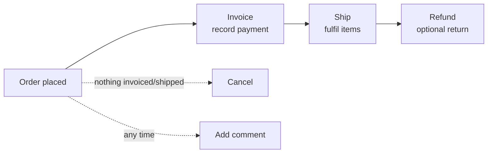

# Order Fulfillment Actions (Admin)

Once an order exists it moves through a lifecycle — invoice, ship, refund, or cancel. Each action is a per-order endpoint under `/api/admin/orders/{id}/…` with its **own eligibility guard**: it refuses with a clear error when its prerequisite isn't met. This page is the theory; open each linked page for the exact body.

## Agent-ask inputs

- **Integration token** — ask the user; send as `Authorization: Bearer <id>|<token>`. Each action is gated by its permission (`sales.invoices.create`, `sales.shipments.create`, `sales.refunds.create`, `sales.orders.cancel`) — a role without it returns `403`.
- **Server URL** — ask the user for their Bagisto server's base URL (e.g. `https://store.example.com`) and prefix every endpoint path with it. Never assume localhost or a demo domain.

## Lifecycle

A fulfilled order runs **Invoice → Ship → (Refund)**; an abandoned one runs **Cancel**. Comments work at any stage.

## The actions and their guards

| Action | Endpoint | Guard (refuses when…) |
|--------|----------|------------------------|
| **Invoice** | [POST invoices](/api/rest-api/admin/sales/orders/create-invoice) | closed / fraud / nothing left to invoice / **`paypal_standard`** (captured by the gateway, not the admin) / no permission |
| **Shipment** | [POST shipments](/api/rest-api/admin/sales/orders/create-shipment) | closed / fraud / nothing left to ship / **insufficient stock at the chosen inventory source** / no permission |
| **Refund** | [POST refunds](/api/rest-api/admin/sales/orders/create-refund) | closed / fraud / nothing left to refund / amount-zero / amount-exceeds-max / no permission |
| **Refund preview** | [POST refunds/preview](/api/rest-api/admin/sales/orders/refund-preview) | same eligibility as refund, but **never writes** — returns the computed totals |
| **Cancel** | [POST cancel](/api/rest-api/admin/sales/orders/cancel) | closed / fraud / nothing left to cancel (something already fully invoiced or shipped) / no permission |
| **Add comment** | [POST comments](/api/rest-api/admin/sales/orders/add-comment) · [list](/api/rest-api/admin/sales/orders/list-comments) | none — no permission gate |

## Theory & gotchas

- **Invoice records what's owed, not that it's paid.** An invoice can be generated with no captured payment; the order/invoice stays `pending` until a payment transaction is recorded. **Partial invoicing** is allowed (invoice some SKUs now, the rest later) — each line is validated against its remaining `qty_to_invoice`.
- **`canCreateTransaction` on invoice-create** (REST `can_create_transaction`, GraphQL `canCreateTransaction`, default false) auto-records a paid `order_transactions` row for the full invoice amount via the core listener — the "Create Transaction" checkbox on the admin invoice screen. Distinct from the standalone [Record Payment](/api/rest-api/admin/sales/transactions/create) (`POST /api/admin/transactions`), which records a specific amount against an invoice.
- **PayPal Standard orders can't be invoiced** from the admin — the gateway captures asynchronously. The guard returns a distinct message.
- **Shipment needs stock at the source.** Beyond items-awaiting-shipment, the chosen inventory source must hold enough quantity; otherwise the per-SKU guard rejects. Partial shipments allowed.
- **Always Refund-Preview first.** `previewAdminRefund` computes subtotal/discount/tax/shipping/grand-total for the requested lines + adjustments without writing — drive the live "Total Refund" widget from it, then call create-refund. Refund needs an un-refunded invoiced amount (an order generally can't be refunded before it's invoiced).
- **Cancel is early-abort only.** Once anything is fully invoiced or shipped, cancel is refused — use refund instead.
- **Comments email the customer** when `customerNotified` is true (fires the core notification). No permission gate — matches the admin panel.
- **Actions return the refreshed order.** Cancel/invoice/etc. return the full order (same shape as [order detail](/api/rest-api/admin/sales/orders/order-detail)) so the order-view screen refreshes without a follow-up GET. The generated invoice/shipment/refund also appears in its own store-wide menu ([Invoices](/api/rest-api/admin/sales/invoices/) / [Shipments](/api/rest-api/admin/sales/shipments/) / [Refunds](/api/rest-api/admin/sales/refunds/)).

## GraphQL notes

Fields: `createAdminInvoice`, `createAdminShipment`, `createAdminRefund`, `previewAdminRefund`, `createAdminCancelOrder`, `createAdminOrderComment`. These are **action / result mutations** — select the documented result fields (the refreshed order, `success`, `message`), **not** a generic `id` (see the [result-field rule](/api/workflows/admin/#graphql-the-must-know-rules)).

## Status codes to handle

`200/201` success · `401` unauthenticated · `403` permission · `404` order not found · `422` ineligible action / validation (per-SKU qty, refund amount, PayPal invoice).
