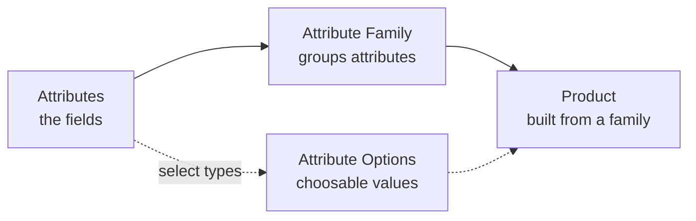
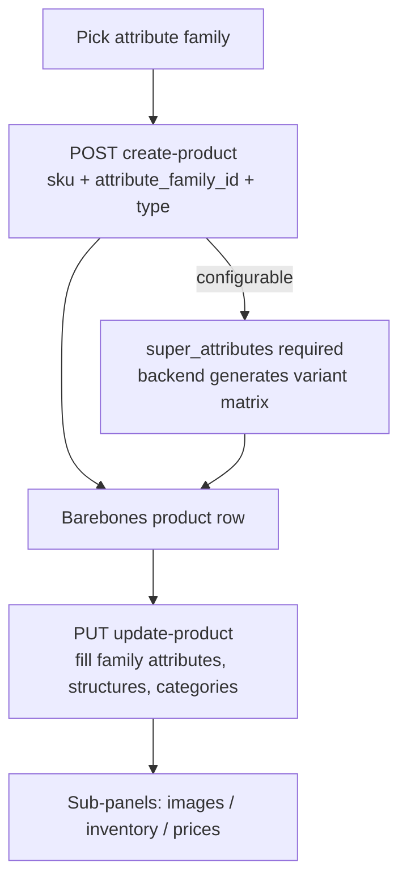

# Product Management (Admin)

Creating and editing products is the most structured admin flow — seven product types, a two-step create, a partial-update that can silently wipe fields if misused, and separate sub-panels for images, inventory, and prices. This page is the theory; open each linked endpoint page for the exact body.

## Agent-ask inputs

- **Integration token** — ask the user; send as `Authorization: Bearer <id>|<token>`. Product create/edit needs the product-create / product-edit permission (else `403`).
- **Server URL** — ask the user for their Bagisto server's base URL (e.g. `https://store.example.com`) and prefix every endpoint path with it. Never assume localhost or a demo domain.

## Two product endpoints — don't confuse them

- **`GET /api/admin/catalog/products`** — the full **datagrid listing** (all columns, filters, sort, mass-actions). This is the Products management screen: [list](/api/rest-api/admin/catalog/products/list).
- **`GET /api/admin/products`** — a **slim Add-Product search** (sku/name/price/image/saleable only) used by [Create-Order](/api/workflows/admin/create-order-flow). Not the product listing.

## First, the schema: attributes → families → products

A product isn't created in a vacuum — it's built from an **attribute family**, and that family is a grouping of **attributes**. So the build order is schema first, data second:



Attributes are the fields; a family groups them into the product form; a product is created against a family and renders that family's fields. Select-type attributes carry options (the choosable values).

- **Attributes** are the dynamic fields a product can carry. Create one with [Attributes → Create](/api/rest-api/admin/catalog/attributes/attributes-create) (`POST /api/admin/catalog/attributes`) — validates code (unique), admin name, type. An attribute of type **select / multiselect / checkbox** owns a set of **options** (the choosable values), managed as a sub-resource: [Attribute Options](/api/rest-api/admin/catalog/attributes/attribute-options). List/detail: [listing](/api/rest-api/admin/catalog/attributes/attributes-listing) · [detail](/api/rest-api/admin/catalog/attributes/attributes-detail).
- **Attribute Families** group attributes (into attribute groups) into the form layout a product edit screen renders. Create one with [Families → Create](/api/rest-api/admin/catalog/families/families-create) (`POST /api/admin/catalog/families`); its detail returns `attributeGroups: [{ code, name, column, position, attributes: [...] }]` — the column layout of the product form. List/detail: [listing](/api/rest-api/admin/catalog/families/families-listing) · [detail](/api/rest-api/admin/catalog/families/families-detail).
- **Products** are created **against a family** — `attribute_family_id` is required at step 1, and that family decides which attribute fields step 2 can fill. For a **configurable** product, the `super_attributes` you pass are the ids/codes of select-type attributes (e.g. color, size) whose **options** generate the variant matrix — so those attributes and their options must exist first.

So: build (or reuse) the attributes and the family before creating the product. In a fresh store the default family already carries the common attributes, so most tools surface Products first and treat Attributes / Families as configuration screens.

## Create is a two-step wizard

Mirror the admin panel — **don't send the whole product in one call.**



1. **Step 1 — [Create](/api/rest-api/admin/catalog/products/create)** (`POST /api/admin/catalog/products`). Body `{ sku, attribute_family_id, type? }` (`type` defaults `simple`). Validates `sku` (required, unique, slug-safe) and `attribute_family_id` (required, exists). Creates a barebones row.
2. **Step 2 — [Update](/api/rest-api/admin/catalog/products/update)** (`PUT /api/admin/catalog/products/{id}`) fills the family's attribute fields, type structures, categories, etc.

**Seven types:** simple / virtual / downloadable / grouped / bundle / configurable / booking.

- **Configurable** needs `super_attributes` at step 1 — a map of attribute **code or id → option ids** (both shapes accepted). The backend generates the full variant matrix from it. Omit it and create returns 422.
- **Booking** sub-types (default / appointment / event / rental / table) and their slots/tickets are configured in step 2, not step 1.

### Step 1 body — by type

A simple product needs only three fields:

```json
{
  "sku": "tshirt-basic",
  "attribute_family_id": 1,
  "type": "simple"
}
```

A configurable product adds `super_attributes` (here color = options 1,2,3 and size = options 4,5) — the backend builds one variant per combination:

```json
{
  "sku": "tshirt-config",
  "attribute_family_id": 1,
  "type": "configurable",
  "super_attributes": {
    "color": [1, 2, 3],
    "size": [4, 5]
  }
}
```

What each type needs at step 1, and what step 2 fills:

| Type | Step 1 | Step 2 fills |
|------|--------|--------------|
| simple / virtual | sku + family (+ type) | attribute values, price, categories |
| downloadable | sku + family + `type` | attribute values + `downloadable_links` / `downloadable_samples` |
| grouped | sku + family + `type` | attribute values + `links` (the grouped child products) |
| bundle | sku + family + `type` | attribute values + `bundle_options` |
| configurable | sku + family + `type` + `super_attributes` | attribute values on the parent; variants already generated |
| booking | sku + family + `type` | attribute values + `booking` (sub-type + slots/tickets) |

### Step 2 body — partial update

Send only what changed. This sets the English name + price and assigns two categories, leaving everything else intact:

```json
{
  "name": "Basic T-Shirt",
  "price": 19.99,
  "categories": [3, 7]
}
```

Pass `?locale=fr&channel=default` to write translatable values (name, description, meta) into a specific locale — one locale per request.

## Update is a partial PATCH — and has wipe traps

Send only the fields you change; every family attribute is editable by its **code**. But some structures **replace** on send and others get **wiped if the core full-form path runs** — know which:

- **Attribute values** — send any family attribute code (`name`, `price`, `color`, `meta_title`, …). Translatable values write to the requested locale — pass `?locale=fr&channel=default` (one locale per request).
- **Type structures** (`variants`, `bundle_options`, `links`, `downloadable_links`, `downloadable_samples`, `booking`) — sending one **replaces** that whole structure.
- **Relations** (`categories`, `channels`, up/cross/related-sells) — sending replaces the set; **omitting preserves** it.
- **Sub-panel data** (`images`, `videos`, `inventories`, `customer_group_prices`) — **ignored here**; they have dedicated endpoints (below). The response lists them under a warnings hint.

Gotcha: an attribute-only edit uses a surgical write that touches only the sent values; a structure-bearing edit runs the full-form path that reconstructs current state first. So a partial edit does not clobber booleans/variants/relations — as long as you don't send an empty structure key. **Open the [Update page](/api/rest-api/admin/catalog/products/update) before writing a partial update.**

## Sub-panels (image / inventory / price tabs)

Each is parent-scoped under `/catalog/products/{productId}/…` and mirrors a tab on the edit screen:

| Sub-panel | Operations |
|-----------|-----------|
| **Images** | [upload](/api/rest-api/admin/catalog/products/images-upload) (REST multipart only — binary `image` part, ≤4 MB; GraphQL upload is rejected) · [reorder](/api/rest-api/admin/catalog/products/images-reorder) · [delete](/api/rest-api/admin/catalog/products/images-delete) |
| **Videos** | [upload](/api/rest-api/admin/catalog/products/videos-upload) (REST multipart) · [delete](/api/rest-api/admin/catalog/products/videos-delete) |
| **Inventory** | [list](/api/rest-api/admin/catalog/products/inventories-list) (`meta.totalQty` sums sources) · [bulk update](/api/rest-api/admin/catalog/products/inventories-update) (`{ inventories: { sourceId: qty } }`; omitted sources untouched, `qty=0` zeroes) |
| **Customer-group prices** | [list](/api/rest-api/admin/catalog/products/customer-group-prices-list) · [create](/api/rest-api/admin/catalog/products/customer-group-prices-create) · [update](/api/rest-api/admin/catalog/products/customer-group-prices-update) · [delete](/api/rest-api/admin/catalog/products/customer-group-prices-delete) (`{ qty, value_type: fixed\|discount, value, customer_group_id }`; null group = all groups; `(qty, group)` unique) |
| **Downloadable** | [file upload](/api/rest-api/admin/catalog/products/downloadable-upload) · [download](/api/rest-api/admin/catalog/products/downloadable-download) (REST binary) |

## Copy & mass-actions

- **[Copy](/api/rest-api/admin/catalog/products/copy)** — `POST /api/admin/catalog/products/{sourceId}/copy`. Refuses a variant (can't copy standalone) → 422. Returns the new product's id + auto-suffixed sku.
- **[Mass-delete](/api/rest-api/admin/catalog/products/mass-delete)** · **[Mass-update-status](/api/rest-api/admin/catalog/products/mass-update-status)** — `{ indices: int[] }` (+ `value: 0|1` for status). Best-effort: missing ids silently skipped.
- **[Export](/api/rest-api/admin/catalog/products/export)** — CSV of the datagrid honouring the listing filters; send `Accept: text/csv`, `?format=csv` only. REST-only.

## GraphQL notes

Query fields: `adminCatalogProducts` (list), `adminCatalogProduct` (detail). Mutations: `createAdminCatalogProduct`, `updateAdminCatalogProduct`, `deleteAdminCatalogProduct`, `createAdminCatalogProductCopy`, `createAdminCatalogProductMassDelete`, `createAdminCatalogProductMassUpdateStatus`. On create/update mutations the nested connections (images, variants, …) come back empty — re-query `adminCatalogProduct` for them. On **mass-actions** select the result fields, not a generic `id` (see the [result-field rule](/api/workflows/admin/#graphql-the-must-know-rules)).

## Status codes to handle

`200/201` success · `401` unauthenticated · `403` permission · `400` bad input · `404` not found · `422` validation (missing `super_attributes`, copying a variant, bad option ids).
