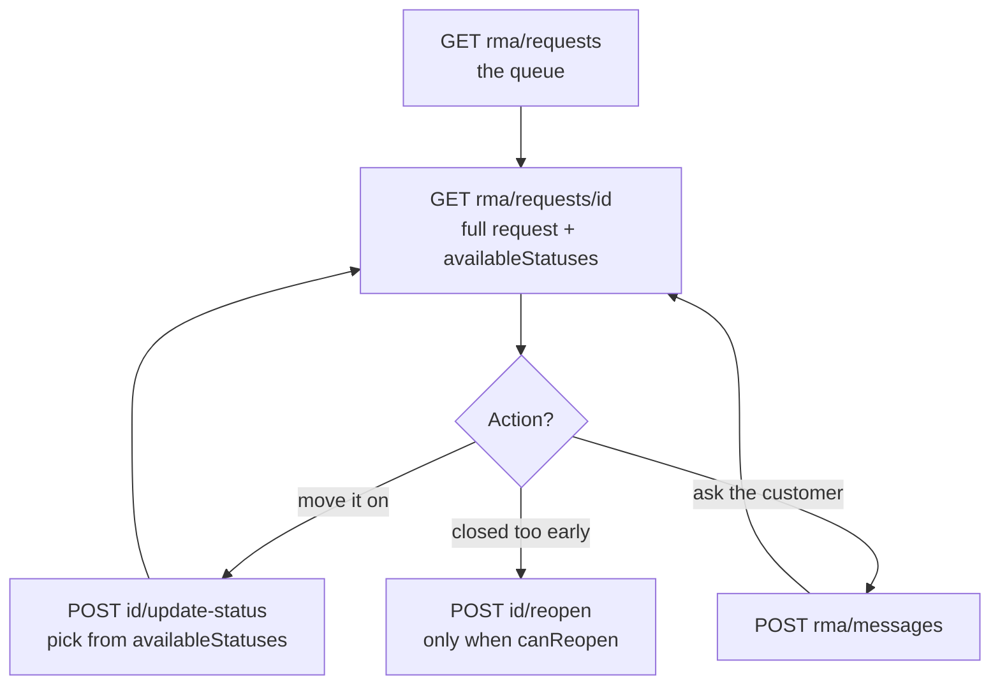

# Returns / RMA (Admin)

Process the return requests customers raise on the storefront: review the queue, move a request through its status chain, exchange messages with the customer, and reopen a closed request. This is the back-office half of the storefront [Returns / RMA](/api/workflows/shop/returns-rma) flow.

Every call below links to its **REST** endpoint page for concreteness. The sequence is transport-agnostic — the same flow works over GraphQL with the equivalent query or mutation, and each REST page cross-links to its GraphQL twin. Pick whichever transport your client uses; only the request shape changes, never the order of steps.

## Agent-ask inputs

- **Integration token** — ask the user; send as `Authorization: Bearer <id>|<token>`. Reads need the RMA-requests permission; creating a return needs its create permission. A missing permission returns 403.
- **Server URL** — ask the user for their Bagisto server's base URL (e.g. `https://store.example.com`) and prefix every endpoint path with it. Never assume localhost or a demo domain.

## Two separate surfaces

The menu splits into the **queue** — the requests themselves, under Sales — and the **reference data** that governs it, under Settings. Both live under the same `/api/admin/rma/` path prefix even though the admin panel shows them in different menus, which is the first thing that trips people up.

| Surface | Path | Purpose |
|---|---|---|
| Requests | `/api/admin/rma/requests` | The queue: list, view, create, status changes, reopen |
| Messages | `/api/admin/rma/messages` | The conversation attached to a request |
| Reasons | `/api/admin/rma/reasons` | Why a customer may return — offered on the storefront form |
| Statuses | `/api/admin/rma/statuses` | The status vocabulary a request moves through |
| Rules | `/api/admin/rma/rules` | Eligibility: the return window and what qualifies |
| Custom fields | `/api/admin/rma/custom-fields` | Extra fields captured on the request form |

Set up the reference data before expecting the storefront form to work — a store with no active reason gives the customer nothing to pick.

## The queue flow



| # | Step | Call |
|---|------|------|
| 1 | List the queue | [List Returns](/api/rest-api/admin/sales/returns/list-returns) |
| 2 | Open one request | [Get Return](/api/rest-api/admin/sales/returns/get-return) |
| 3 | Move its status | [Update Status](/api/rest-api/admin/sales/returns/update-status) |
| 4 | Read the conversation | [List Return Messages](/api/rest-api/admin/sales/returns/list-return-messages) |
| 5 | Reply to the customer | [Send Return Message](/api/rest-api/admin/sales/returns/send-return-message) |
| 6 | Reopen a closed request | [Reopen Return](/api/rest-api/admin/sales/returns/reopen-return) |

## Never hard-code the status list

A request carries `statusId`, `statusTitle`, and `statusColor` — but the field that matters when you build a UI is **`availableStatuses`** on the detail response. It lists only the transitions legal *from where the request currently stands*, as `{ id, title }` pairs:

```json
"availableStatuses": [
  { "id": 2, "title": "Approved" },
  { "id": 7, "title": "Request Declined" }
]
```

Render your status dropdown from that array and pass the chosen `id` to update-status. The full vocabulary from [List Statuses](/api/rest-api/admin/settings/return-statuses/list) is the *catalogue*, not the set of legal next moves — a request sitting at "Pending Review" cannot jump straight to "Refunded", and offering that choice produces a rejected call.

The nine shipped statuses are Pending Review, Approved, Awaiting Return, Return In Transit, Refunded, Solved, Request Declined, Item Canceled, and Request Canceled. All are editable, so treat titles as data rather than constants.

## Reopening

`canReopen` on the detail response tells you whether the reopen action applies — it is only meaningful once a request has reached a closed state. Show the button from that boolean rather than inferring it from the status title, which is editable and translatable.

## Creating a return as the admin

Admins can raise a return on the customer's behalf, which is how a phone or email request gets into the system. It needs two lookups first:

1. [Returnable Items](/api/rest-api/admin/sales/returns/list-returnable-items) — which of the order's items are still eligible, given the return window from the active rule.
2. [Return Reasons](/api/rest-api/admin/sales/returns/list-return-reasons) — filtered by `resolutionType`, because a reason may permit a return, a cancellation, or both.

Then [Create Return](/api/rest-api/admin/sales/returns/create-return) with the order, the items, and the chosen reason.

A reason carries an `isAdmin` flag. Reasons flagged admin-only never appear on the storefront form and exist for exactly this path — so the list an admin sees can legitimately be longer than the customer's.

## Reference data, and why the order matters

Rules decide **eligibility**, so they gate everything else. A rule defines the return period in days plus what it applies to; the returnable-items lookup is computed against it, and an order outside the window returns nothing eligible no matter how the request is filed. Configure a rule before testing the flow end to end, or the storefront form will look broken when it is behaving correctly.

Reasons, statuses, and custom fields are ordinary CRUD with mass-delete and mass-update-status, documented under Settings:

- [Return Reasons](/api/rest-api/admin/settings/return-reasons/list)
- [Return Statuses](/api/rest-api/admin/settings/return-statuses/list)
- [Return Rules](/api/rest-api/admin/settings/return-rules/list)
- [Return Custom Fields](/api/rest-api/admin/settings/return-custom-fields/list)

## Where this meets the storefront

The customer raises and tracks the request through the [storefront RMA flow](/api/workflows/shop/returns-rma); the admin sees the same record here. Messages are shared — a reply sent from either side appears in the other's conversation — so the two flows are one thread, not two.
