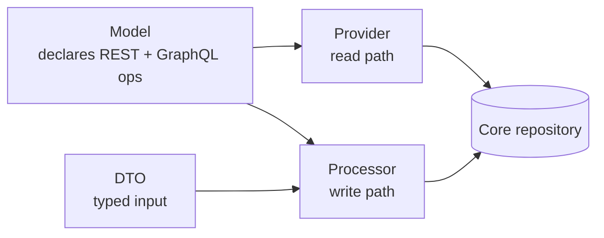

# Folder Structure

Every API resource is the same five files plus lang and tests. Each has one job.

The Model declares the endpoints. Reads go through a Provider, writes through a Processor, and both hit the core repository:

`lang` strings and the two test files hang off each resource — see the table below.

| Unit | Path shape | Responsibility |
|------|-----------|----------------|
| Model | `src/*/Models/*.php` | `#[ApiResource]` — declares REST + GraphQL operations and the OpenAPI block |
| DTO | `src/*/Dto/*Input.php` | Typed input contract (validation surface + GraphQL input type) |
| Provider | `src/*/State/*Provider.php` | Read path: auth, query, response envelope |
| Processor | `src/*/State/*Processor.php` | Write path: validation, core repo call, events, permission gate |
| Resolver | `src/*/Resolver/*.php` | GraphQL custom query resolver (only when needed) |
| lang | `Resources/lang/en/app.php` | All user-facing strings (single-file convention) |
| tests | `tests/Feature/{RestApi,GraphQL}/*Test.php` | Lock both transports |

Shop resources live under `src/{Models,Dto,State}`. New collection/item providers extend the shared abstract base providers — reuse, don't re-scaffold.

## Admin resources are different

Admin uses the same file roles, but everything lives under `src/Admin/**` and every class is prefixed `Admin` (e.g. `AdminAttributeProcessor`). Two differences to know:

**The read path is split into two providers**, not one:

| File | Path shape | Job |
|------|-----------|-----|
| Collection provider | `src/Admin/State/Admin*CollectionProvider.php` | List (filter, sort, paginate) |
| Item provider | `src/Admin/State/Admin*ItemProvider.php` | Single record read |
| Processor | `src/Admin/State/Admin*Processor.php` | Write (create / update) |
| Mass-delete processor | `src/Admin/State/Admin*MassDeleteProcessor.php` | Bulk delete |

**Admin has extra folders** shop doesn't:

- `src/Admin/Rules/` — validation rule classes (shop keeps these in `src/Validators/`).
- `src/Admin/DataGrids/` — list filter/sort/pagination definitions backing the collection providers.

Keep the shop and admin trees separate.
