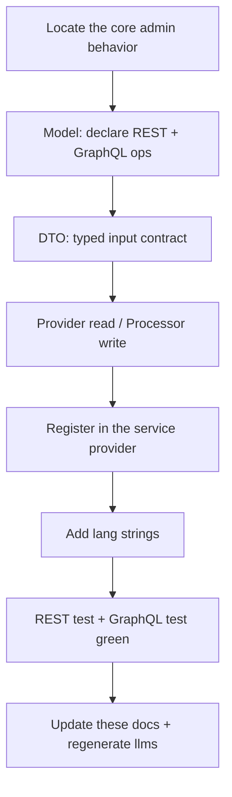

# Customization

For developers extending the Bagisto API itself — adding or changing REST/GraphQL endpoints. The agent skills and machine index teach an agent to CONSUME the API; this section teaches a human to EXTEND it.

## Install the build skills first

```bash
npx skills add bagisto/agent-skills --skill "bagisto-api-develop"
npx skills add bagisto/agent-skills --skill "pest-testing"
```

## Principles

- **Parity with admin, not superset** — the API mirrors what the Bagisto admin panel can do. When core lacks a feature, the API returns a clear "not supported" rather than half-extending.
- **DRY** — every cross-cutting concern has one home (auth helper, collection envelope, base providers). Reuse before writing new.
- **One resource = five files** — see [Folder Structure](/api/workflows/customization/folder-structure).
- **Both transports, always** — every Provider/Processor serves REST AND GraphQL, so a REST change needs the GraphQL test green. See [Testing](/api/workflows/customization/testing).

## The build sequence


