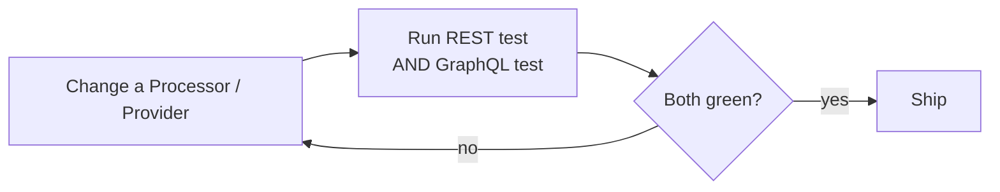

# Testing

## The golden rule

Every Processor and Provider serves BOTH REST and GraphQL. So a REST change can break GraphQL through the shared class. **After any REST change, run the affected resource's GraphQL test before considering it done.**



## How tests retain old APIs while building new

- A resource's REST + GraphQL test files pin the request/response shape. Existing tests are the contract for existing consumers — they must stay green when you add a new endpoint, which proves the old behavior is unchanged.
- A new endpoint ships with its own REST test AND GraphQL test covering the happy path and edge cases (missing input, unauthenticated, permission denied). The new tests guard the new behavior; the untouched old tests guard the old.
- Install the testing skill for the framework rules:

```bash
npx skills add bagisto/agent-skills --skill "pest-testing"
```

## Commands

```bash
# GraphQL test for the changed resource (regression check first)
php artisan test packages/Webkul/BagistoApi/tests/Feature/GraphQL/<Resource>Test.php

# REST test for the changed resource
php artisan test packages/Webkul/BagistoApi/tests/Feature/RestApi/<Resource>Test.php
```
