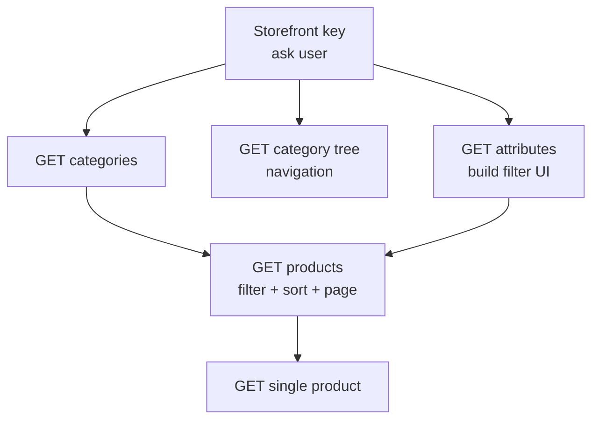

# Browse & Filter Catalog (Shop)

The storefront browse path — list categories, build the filter UI from attributes, then list products with filters, sort, and pagination, and open a single product. All of this is **public**: the storefront key alone is enough, no customer login.

## Prerequisites

- A valid storefront key ([Setup](/api/setup), [Authentication](/api/authentication)).
- Optional context via `X-LOCALE` / `X-CURRENCY` / `X-CHANNEL` headers (see [Authentication → Optional Context Headers](/api/authentication#optional-context-headers)).

Paging, sorting, and filter syntax are the same across every list — see the central [Pagination](/api/pagination) and [Sorting](/api/sorting) references.

## Dependency diagram

## Ordered call table

| # | Step | Endpoint | Depends on | Note |
|---|------|----------|-----------|------|
| 1 | List categories | [GET categories](/api/rest-api/shop/categories/get-categories) · [GraphQL](/api/graphql-api/shop/category/) | storefront key | Flat list; filter direct children with `?parent_id=N` |
| 2 | Category tree (nav) | [GET category tree](/api/rest-api/shop/categories/get-category-tree) · [GraphQL](/api/graphql-api/shop/category/) | storefront key | Nested tree for menus |
| 3 | Filterable attributes | [GET attributes](/api/rest-api/shop/attributes/get-attributes) · [attribute options](/api/rest-api/shop/attributes/get-attribute-options) | storefront key | Build the filter sidebar (colour, size, …) |
| 4 | List / filter / sort products | [GET products](/api/rest-api/shop/products/get-products) · [search](/api/rest-api/shop/products/search-product) · [GraphQL](/api/graphql-api/shop/product/) | a category or search term | `?type` `?category_id` `?price` `?new` `?featured` `?<attr>` + `?sort` + `?page`/`?per_page` |
| 5 | Single product | [GET single product](/api/rest-api/shop/products/get-product) · [GraphQL](/api/graphql-api/shop/product/) | a product id (REST) or `urlKey` (GraphQL) | Full detail — variants, images, price, sub-resources |

> **GraphQL equivalents:** the fields are `categories`, `treeCategories(parentId:)` (children — **not** a `parentId` arg on `categories`), `attributes`, `products`, and `product`. Filters go into a single JSON `filter:` string and sort into `sortKey`/`reverse`.

## End-to-end sequence

- **Category page:** categories → products (`category_id`, sort, page) → single product.
- **Search page:** search-product (`query`, filters, sort, page) → single product.
- **Filtered listing:** attributes (build UI) → products (`?color=…&size=…&price=…`) → single product.

The one thing that does not carry over literally between transports is category children: REST `?parent_id=`, GraphQL `treeCategories(parentId:)`. Everything else maps directly.

## Customize

To change catalog behavior on the server, see [Customization → Shop](/api/workflows/customization/).
