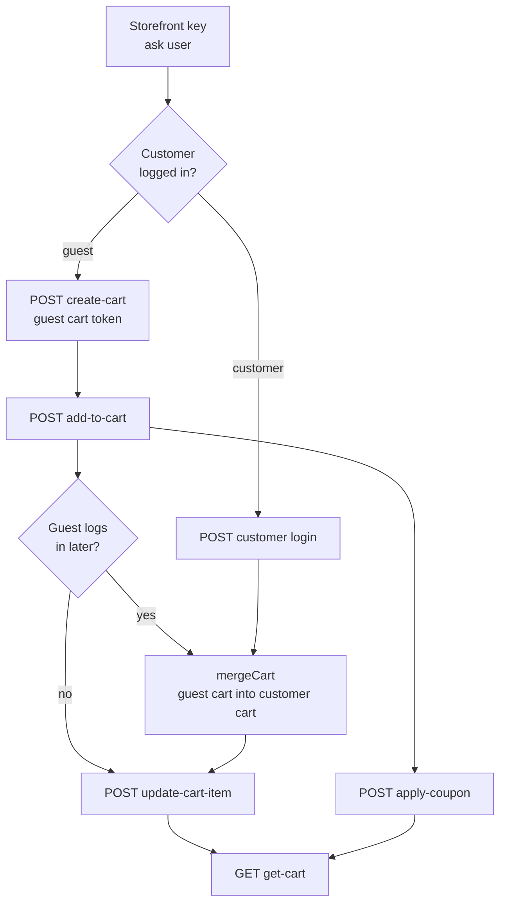

# Cart Workflow (Shop)

Build a cart for a guest or a logged-in customer: create/obtain the cart, add and update items, apply coupons, and merge a guest cart into the customer cart at login.

## Agent-ask inputs

- **Storefront key** — ask the user; send it as the storefront key header on every Shop request. Never invent it.
- **Server URL** — ask the user for their Bagisto server's base URL (e.g. `https://store.example.com`) and prefix every endpoint path with it. Never assume localhost or a demo domain.

## Prerequisites

- A valid storefront key ([Setup](/api/setup), [Authentication](/api/authentication)).
- For the customer path: a logged-in customer ([Customer login](/api/rest-api/shop/customers)).

**When does a merge happen?** A guest adds items to a guest cart, then decides to log in. On login you call **mergeCart** with the guest cart token — the guest cart's items are merged into the customer's own cart so nothing is lost.

## Dependency diagram

## Ordered call table

| # | Step | Endpoint | Depends on | Note |
|---|------|----------|-----------|------|
| 1 | Create guest cart | [POST create-cart](/api/rest-api/shop/cart/create-cart) · [GraphQL](/api/graphql-api/shop/cart) | storefront key | Guest path only; returns a cart token |
| 2 | Customer login | [POST login](/api/rest-api/shop/customers/customer-login) | storefront key | Customer path; after login, merge the guest cart (step 3) |
| 3 | Merge guest cart | [POST merge-cart](/api/rest-api/shop/cart/merge-cart) · [GraphQL](/api/graphql-api/shop/mutations/merge-cart) | a guest cart id + a logged-in customer (customer Bearer token) | Merges the guest cart's items into the customer cart so nothing is lost |
| 4 | Add item | [POST add-to-cart](/api/rest-api/shop/cart/add-to-cart) · [GraphQL](/api/graphql-api/shop/cart) | cart (guest token or logged-in customer) | Same endpoint for both paths |
| 5 | Update item qty | [POST update-cart-item](/api/rest-api/shop/cart/update-cart-item) | an item in the cart | |
| 6 | Apply coupon | [POST apply-coupon](/api/rest-api/shop/cart/apply-coupon) | an item in the cart | Remove with [remove-coupon](/api/rest-api/shop/cart/remove-coupon) |
| 7 | Read cart | [GET get-cart](/api/rest-api/shop/cart/get-cart) · [GraphQL](/api/graphql-api/shop/cart) | any cart mutation | Totals, items, applied coupon |

## End-to-end example

Guest: create-cart → add-to-cart → apply-coupon → get-cart.
Guest who then logs in: create-cart (guest) → add-to-cart → login → **mergeCart** → get-cart.
Follow each linked page for the exact request/response body (REST and GraphQL).

## Customize

To change cart behavior on the server, see [Customization → Shop](/api/workflows/customization/).
