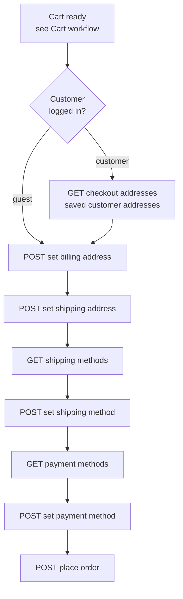

# Checkout Workflow (Shop)

Turn a ready cart into an order: set addresses, choose a shipping method, choose a payment method, place the order. A logged-in customer's saved addresses (and past orders) are surfaced so they can reuse them.

## Prerequisites

- A cart with at least one item ([Cart workflow](/api/workflows/shop/cart)).
- A valid storefront key.

## Dependency diagram

## Ordered call table

| # | Step | Endpoint | Depends on | Note |
|---|------|----------|-----------|------|
| 1 | Read saved addresses | [GET addresses](/api/rest-api/shop/checkout/get-addresses) | logged-in customer | Customer path; prefill from saved. Past orders: [customer orders](/api/rest-api/shop/customer-orders) |
| 2 | Set billing address | [POST set-billing-address](/api/rest-api/shop/checkout/set-billing-address) · [GraphQL](/api/graphql-api/shop/checkout) | cart with items | Guest sends a full address; customer may reuse a saved one |
| 3 | Set shipping address | [POST set-shipping-address](/api/rest-api/shop/checkout/set-shipping-address) | billing set | |
| 4 | List shipping methods | [GET shipping-methods](/api/rest-api/shop/checkout/get-shipping-methods) | shipping address set | |
| 5 | Set shipping method | [POST set-shipping-method](/api/rest-api/shop/checkout/set-shipping-method) | a chosen shipping method | |
| 6 | List payment methods | [GET payment-methods](/api/rest-api/shop/checkout/get-payment-methods) | shipping method set | |
| 7 | Set payment method | [POST set-payment-method](/api/rest-api/shop/checkout/set-payment-method) | a chosen payment method | |
| 8 | Place order | [POST place-order](/api/rest-api/shop/checkout/place-order) · [GraphQL](/api/graphql-api/shop/checkout) | payment method set | Returns the created order |

> **GraphQL equivalents:** the table links REST paths. Each step has a GraphQL operation (`createCheckoutAddress`, `collectionShippingRates`, `createCheckoutShippingMethod`, `collectionPaymentMethods`, `createCheckoutPaymentMethod`, `createCheckoutOrder`) — the full REST↔GraphQL list is on the [Cart & Checkout mapping](/api/rest-graphql-mapping/shop/cart-checkout).

## Payment methods & completing the order

`GET payment-methods` returns whatever the store has enabled. There are two kinds, and the client handles them differently at **set payment method**:

| Kind | Methods | What `set-payment-method` returns | Client action |
|---|---|---|---|
| **On-site** | `cashondelivery`, `moneytransfer` | `paymentGatewayUrl: null` | Go straight to **place-order** |
| **Offsite gateway** | `stripe`, `payu`, `phonepe`, `razorpay`, `paypal_standard`, `paypal_smart_button` | a non-null `paymentGatewayUrl` | **Redirect** the shopper to that URL; the order is created when they return to your success URL |

For an offsite gateway, pass your `paymentSuccessUrl` / `paymentFailureUrl` when setting the payment method, then redirect to `paymentGatewayUrl`. Do **not** call place-order yourself for those — the gateway's return flow finalises the order. On-site methods place the order directly.

::: warning Offsite return (mobile / WebView clients)
The order row is created only when the shopper's browser lands on the store's **success** route after paying. If your app closes the payment view too early (before that return), the payment can succeed with no order created. Keep the view open until it reaches your success URL.
:::

## End-to-end sequence

- **Customer:** get-addresses → set-billing → set-shipping → get-shipping-methods → set-shipping-method → get-payment-methods → set-payment-method → *(on-site)* place-order **or** *(offsite)* redirect to `paymentGatewayUrl`.
- **Guest:** same, minus get-addresses (send a full billing / shipping address).

Follow each linked endpoint page for the exact request / response body.

## Customize

To change checkout behavior on the server, see [Customization → Shop](/api/workflows/customization/).
