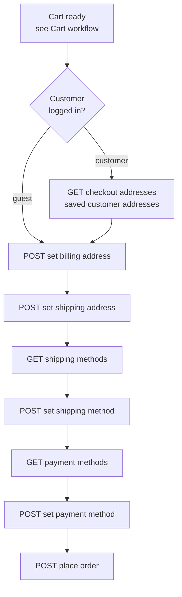

# Checkout Workflow (Shop)

Turn a ready cart into an order: set addresses, choose a shipping method, choose a payment method, place the order. A logged-in customer's saved addresses (and past orders) are surfaced so they can reuse them.

## Agent-ask inputs

- **Storefront key** — ask the user; send it on every Shop request. Never invent it.
- **Server URL** — ask the user for their Bagisto server's base URL (e.g. `https://store.example.com`) and prefix every endpoint path with it. Never assume localhost or a demo domain.

## Prerequisites

- A cart with at least one item ([Cart workflow](/api/workflows/shop/cart)).
- A valid storefront key.

## Dependency diagram

## Ordered call table

| # | Step | Endpoint | Depends on | Note |
|---|------|----------|-----------|------|
| 1 | Read saved addresses | [GET addresses](/api/rest-api/shop/checkout/get-addresses) | logged-in customer | Customer path; prefill from saved. Past orders: [customer orders](/api/rest-api/shop/customer-orders) |
| 2 | Set billing address | [POST set-billing-address](/api/rest-api/shop/checkout/set-billing-address) · [GraphQL](/api/graphql-api/shop/checkout) | cart with items | Guest sends a full address; customer may reuse a saved one |
| 3 | Set shipping address | [POST set-shipping-address](/api/rest-api/shop/checkout/set-shipping-address) | billing set | |
| 4 | List shipping methods | [GET shipping-methods](/api/rest-api/shop/checkout/get-shipping-methods) | shipping address set | |
| 5 | Set shipping method | [POST set-shipping-method](/api/rest-api/shop/checkout/set-shipping-method) | a chosen shipping method | |
| 6 | List payment methods | [GET payment-methods](/api/rest-api/shop/checkout/get-payment-methods) | shipping method set | |
| 7 | Set payment method | [POST set-payment-method](/api/rest-api/shop/checkout/set-payment-method) | a chosen payment method | |
| 8 | Place order | [POST place-order](/api/rest-api/shop/checkout/place-order) · [GraphQL](/api/graphql-api/shop/checkout) | payment method set | Returns the created order |

## End-to-end example

Customer: get-addresses → set-billing → set-shipping → get-shipping-methods → set-shipping-method → get-payment-methods → set-payment-method → place-order.
Guest: same, minus get-addresses (send a full billing/shipping address).
Follow each linked page for the exact request/response body (REST and GraphQL).

## Customize

To change checkout behavior on the server, see [Customization → Shop](/api/workflows/customization/).
