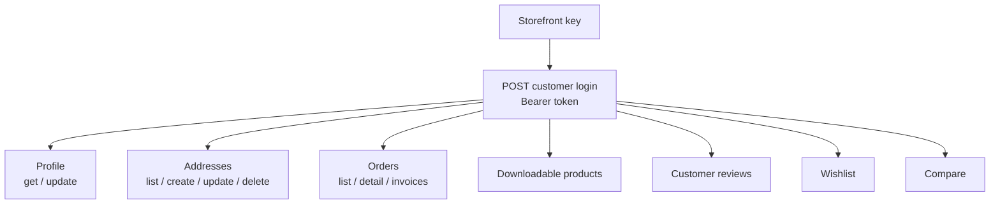

# Customer Account (Shop)

Everything behind a customer login: profile, addresses, order history and invoices, downloadable products, reviews, wishlist, and compare. Every call here needs both the storefront key **and** the customer Bearer token from login.

## Prerequisites

- A valid storefront key ([Setup](/api/setup), [Authentication](/api/authentication)).
- A logged-in customer — the Bearer is the `token` field from [login](/api/rest-api/shop/customers/customer-login) (not `apiToken`).

## Dependency diagram

## Ordered call table

| # | Step | Endpoint | Note |
|---|------|----------|------|
| 1 | Login | [POST login](/api/rest-api/shop/customers/customer-login) · [GraphQL](/api/graphql-api/shop/customer/) | Returns the customer Bearer `token` |
| 2 | Get / update profile | [GET profile](/api/rest-api/shop/customers/get-customer-profile) · [update](/api/rest-api/shop/customers/update-customer-profile) · [GraphQL](/api/graphql-api/shop/customer/) | Change password via [change-password](/api/rest-api/shop/customers/change-password) |
| 3 | Manage addresses | [list](/api/rest-api/shop/customers/get-customer-addresses) · [create](/api/rest-api/shop/customers/create-customer-address) · [update](/api/rest-api/shop/customers/update-customer-address) · [delete](/api/rest-api/shop/customers/delete-customer-address) | Reused at checkout |
| 4 | Order history | [list orders](/api/rest-api/shop/customer-orders/get-customer-orders) · [order detail](/api/rest-api/shop/customer-orders/get-customer-order) | `?status=` filters the list |
| 5 | Invoices | [list](/api/rest-api/shop/customer-invoices/get-customer-invoices) · [invoice](/api/rest-api/shop/customer-invoices/get-customer-invoice) · [PDF](/api/rest-api/shop/customer-invoices/download-customer-invoice-pdf) | PDF is a binary download |
| 6 | Downloadable products | [list](/api/rest-api/shop/customer-downloadable-products/get-customer-downloadable-products) · [item](/api/rest-api/shop/customer-downloadable-products/get-customer-downloadable-product) | Purchased downloadable links |
| 7 | Reviews | [list](/api/rest-api/shop/customer-reviews/get-customer-reviews) · [review](/api/rest-api/shop/customer-reviews/get-customer-review) · [GraphQL](/api/graphql-api/shop/product-review/) | The customer's own reviews |
| 8 | Wishlist | [list](/api/rest-api/shop/wishlist/list) · [toggle](/api/rest-api/shop/wishlist/toggle) · [move to cart](/api/rest-api/shop/wishlist/move-to-cart) · [GraphQL](/api/graphql-api/shop/wishlist/) | Channel-scoped |
| 9 | Compare | [list](/api/rest-api/shop/compare/list) · [create](/api/rest-api/shop/compare/create) · [delete](/api/rest-api/shop/compare/delete) · [GraphQL](/api/graphql-api/shop/compare/) | Not channel-scoped |

> **GraphQL equivalents:** `readCustomerProfile`, `customerOrders`, `wishlists` / `toggleWishlist`, `compareItems`, `productReviews`, plus the address mutations. The full REST↔GraphQL list is on the [Customer Account mapping](/api/rest-graphql-mapping/shop/customer-account).

## Notes

- These are all independent branches off login — call only the ones your screen needs.
- Every step is owner-scoped: a customer only ever sees their own data. Another customer's id returns `403`/`404` (see [Errors](/api/errors)).
- Returns (RMA), EU Withdrawal, and GDPR are their own flows — see the pages below.

## Customize

To change account behavior on the server, see [Customization → Shop](/api/workflows/customization/).
