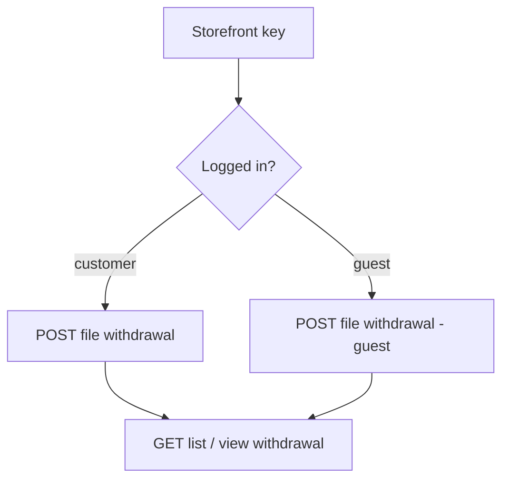

# EU Withdrawal (Shop)

The EU right-of-withdrawal flow — a shopper files a withdrawal against an order, then tracks it. Works for a logged-in customer or a guest (a separate guest endpoint that identifies the order without a login).

## Prerequisites

- A valid storefront key ([Setup](/api/setup), [Authentication](/api/authentication)).
- **Customer path:** a logged-in customer (Bearer `token`).
- **Guest path:** no login — the guest endpoint identifies the order from the order reference.

## Dependency diagram

## Ordered call table

| # | Step | Endpoint | Depends on | Note |
|---|------|----------|-----------|------|
| 1 | File withdrawal (customer) | [POST file](/api/rest-api/shop/eu-withdrawal/create-eu-withdrawal) · [GraphQL](/api/graphql-api/shop/eu-withdrawal/mutations/create-eu-withdrawal) | logged-in customer + an order | Files against the customer's order |
| 1b | File withdrawal (guest) | [POST file (guest)](/api/rest-api/shop/eu-withdrawal/create-guest-eu-withdrawal) · [GraphQL](/api/graphql-api/shop/eu-withdrawal/mutations/create-guest-eu-withdrawal) | an order reference | No login; identifies the order directly |
| 2 | List withdrawals | [GET list](/api/rest-api/shop/eu-withdrawal/list-eu-withdrawals) · [GraphQL](/api/graphql-api/shop/eu-withdrawal/queries/list-eu-withdrawals) | logged-in customer | Customer's filed withdrawals |
| 3 | View withdrawal | [GET view](/api/rest-api/shop/eu-withdrawal/view-eu-withdrawal) · [GraphQL](/api/graphql-api/shop/eu-withdrawal/queries/view-eu-withdrawal) | a filed withdrawal | Status + detail |

> **GraphQL equivalents:** `euWithdrawals` / `euWithdrawal` (track) and the `createEuWithdrawal` / `createGuestEuWithdrawal` mutations. Select **result fields** on the mutation payload, not `id` — see [Identifiers](/api/graphql-api/identifiers).

## End-to-end sequence

- **Customer:** file withdrawal → list / view to track.
- **Guest:** file withdrawal (guest) with the order reference — no login, no account listing.

## Customize

Every call below links to its **REST** endpoint page for concreteness. The sequence is transport-agnostic — the same flow works over GraphQL with the equivalent query or mutation, and each REST page cross-links to its GraphQL twin. Pick whichever transport your client uses; only the request shape changes, never the order of steps.

To change withdrawal behavior on the server, see [Customization → Shop](/api/workflows/customization/).
