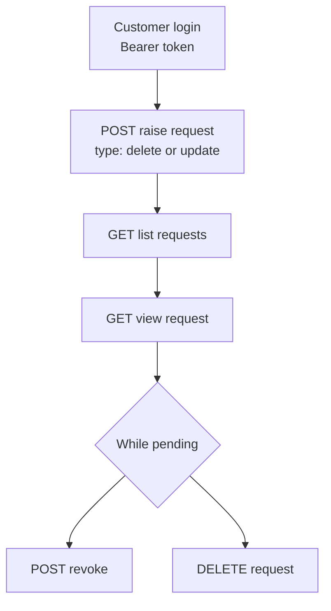

# GDPR Requests (Shop)

A customer raises a data request (delete or update their data), lists and views their own requests, revokes a pending one, or deletes the record. The whole surface is gated by an admin setting — when GDPR is disabled in the admin configuration, every call returns an error.

## Prerequisites

- A valid storefront key ([Setup](/api/setup), [Authentication](/api/authentication)).
- A logged-in customer (Bearer `token`) — requests are owner-scoped.
- GDPR enabled in the admin configuration. If it is off, every endpoint returns `400` with a "GDPR is disabled" message.

## Dependency diagram

## Ordered call table

| # | Step | Endpoint | Depends on | Note |
|---|------|----------|-----------|------|
| 1 | Raise request | [POST raise](/api/rest-api/shop/gdpr-requests/create-gdpr-request) · [GraphQL](/api/graphql-api/shop/gdpr-requests/mutations/create-gdpr-request) | logged-in customer | Body `{ type: delete \| update, message }` → `201` pending |
| 2 | List own requests | [GET list](/api/rest-api/shop/gdpr-requests/list-gdpr-requests) · [GraphQL](/api/graphql-api/shop/gdpr-requests/queries/list-gdpr-requests) | logged-in customer | Only yours |
| 3 | View request | [GET view](/api/rest-api/shop/gdpr-requests/view-gdpr-request) · [GraphQL](/api/graphql-api/shop/gdpr-requests/queries/view-gdpr-request) | one of your requests | `404` if not yours |
| 4 | Revoke | [POST revoke](/api/rest-api/shop/gdpr-requests/revoke-gdpr-request) · [GraphQL](/api/graphql-api/shop/gdpr-requests/mutations/revoke-gdpr-request) | a pending / processing request | `422` if already resolved |
| 5 | Delete record | [DELETE request](/api/rest-api/shop/gdpr-requests/delete-gdpr-request) · [GraphQL](/api/graphql-api/shop/gdpr-requests/mutations/delete-gdpr-request) | one of your requests | Removes the request record |

> **GraphQL equivalents:** `gdprRequests` / `gdprRequest` (read) and the `createGdprRequest` / `revokeGdprRequest` / `deleteGdprRequest` mutations. Select **result fields** on the mutation payloads, not `id` — see [Identifiers](/api/graphql-api/identifiers).

## End-to-end sequence

raise (delete or update) → list → view → revoke while still pending, or delete the record.

Revoke only applies while the request is `pending` or `processing`; once the store has resolved it, revoke returns `422` (see [Errors](/api/errors)).

## Customize

To change GDPR behavior on the server, see [Customization → Shop](/api/workflows/customization/).
