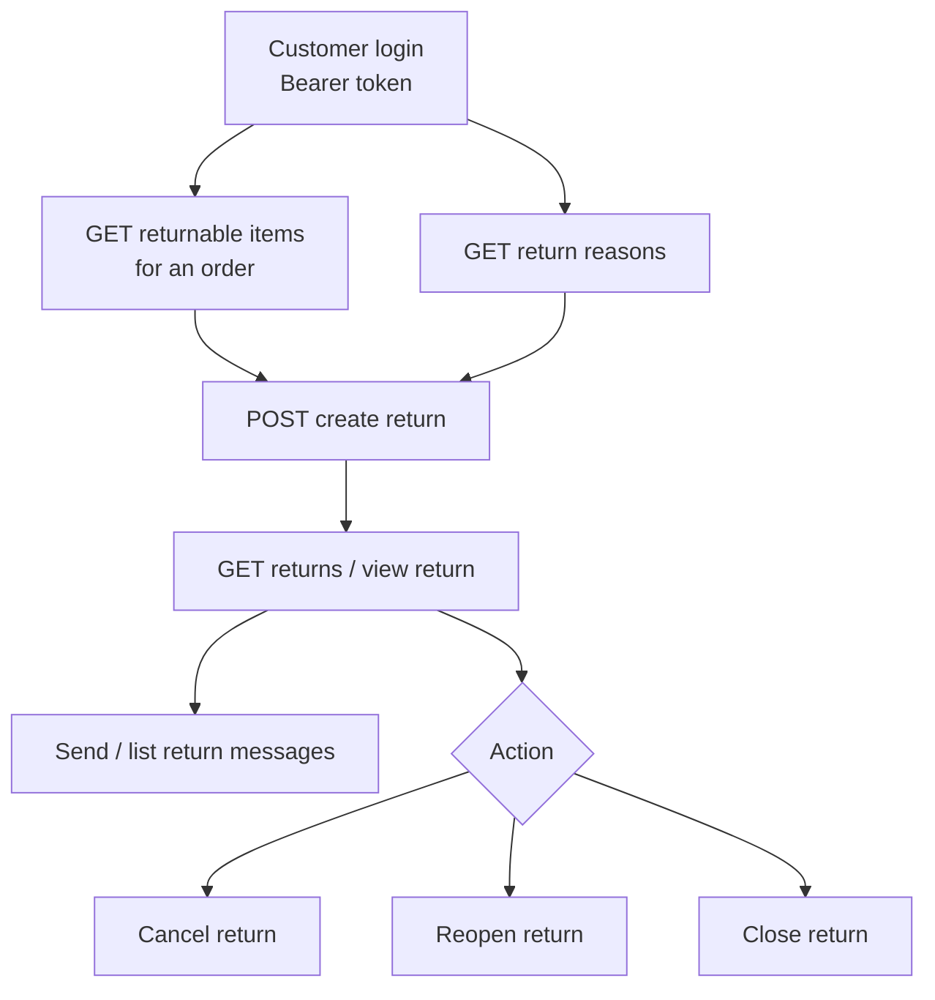

# Returns / RMA (Shop)

A customer files a return against a delivered order, then tracks and messages on it. The flow: find the returnable items on an order, pick a reason, create the return, then track / message / cancel / reopen / close it.

## Prerequisites

- A valid storefront key ([Setup](/api/setup), [Authentication](/api/authentication)).
- A logged-in customer (Bearer `token`).
- An order with returnable items — returns are only offered for eligible, delivered items.

## Dependency diagram

## Ordered call table

| # | Step | Endpoint | Depends on | Note |
|---|------|----------|-----------|------|
| 1 | List returnable items | [GET returnable items](/api/rest-api/shop/returns/list-returnable-items) · [GraphQL](/api/graphql-api/shop/returns/queries/list-returnable-items) | an eligible order | Which items on the order can be returned |
| 2 | List return reasons | [GET reasons](/api/rest-api/shop/returns/list-return-reasons) · [GraphQL](/api/graphql-api/shop/returns/queries/list-return-reasons) | storefront key | Populate the reason dropdown |
| 3 | Create return | [POST create return](/api/rest-api/shop/returns/create-return) · [GraphQL](/api/graphql-api/shop/returns/mutations/create-return) | returnable items + a reason | Files the RMA request |
| 4 | Track returns | [list](/api/rest-api/shop/returns/list-returns) · [view](/api/rest-api/shop/returns/view-return) · [GraphQL](/api/graphql-api/shop/returns/queries/list-returns) | a created return | Status + history |
| 5 | Messages | [send](/api/rest-api/shop/returns/send-return-message) · [list](/api/rest-api/shop/returns/list-return-messages) · [GraphQL](/api/graphql-api/shop/returns/mutations/send-return-message) | a return | Back-and-forth with the store |
| 6 | Cancel / Reopen / Close | [cancel](/api/rest-api/shop/returns/cancel-return) · [reopen](/api/rest-api/shop/returns/reopen-return) · [close](/api/rest-api/shop/returns/close-return) | a return in the right state | State transitions |

> **GraphQL equivalents:** `customerReturns` / `customerReturn` (track), `returnableItems`, `returnReasons`, and the `createCustomerReturn` / `cancelCustomerReturn` / `reopenCustomerReturn` / `closeCustomerReturn` / `sendReturnMessage` mutations. Select **result fields** (not `id`) on the mutation payloads — see [Identifiers](/api/graphql-api/identifiers).

## End-to-end sequence

returnable items + reasons → create return → view return (track) → send message (if needed) → cancel / reopen / close.

State transitions are gated: an action that doesn't apply to the return's current state returns an error (see [Errors](/api/errors)).

## Customize

To change return behavior on the server, see [Customization → Shop](/api/workflows/customization/).
